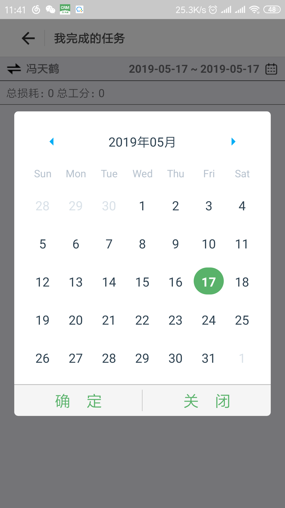

### 安装(Install)
```
yarn add react-native-date-range-dialog
```
### 使用(Use)
```javascript
import DateRangeDialog from 'react-native-date-range-dialog'

<DateRangeDialog>
...
</DateRangeDialog>
```
### 描述(Dependencies)
本组件依赖 react-native-calendars 和 moment 有什么其他建议可以一起优化


### 参数
|key|type|required|default|desc|version|
|---- |---- |---- |---- |---- |---- |
|start|PropTypes.string||today|||
| end |PropTypes.string||today|||
| visible |PropTypes.bool|children?false:true|false|||
| themeColor |PropTypes.string||#59b26a|||
| beforeVisible |PropTypes.func|||||
| monthFormat |PropTypes.string||yyyy年MM月|||
| onCancel |PropTypes.func|||||
| onConfirm |PropTypes.func|||||